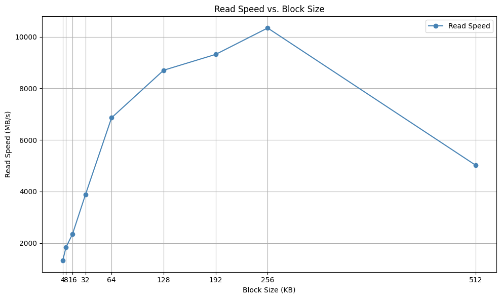
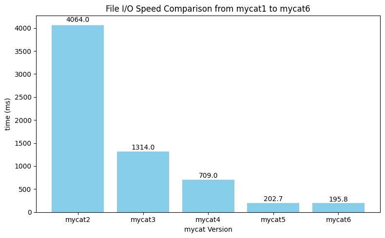

#### 任务三
#####  为什么将缓冲区对齐到系统的内存页可能提高性能？实验结果支持这个猜想吗？为什么？
很明显根据实验结果来看，将缓冲区对齐到系统的页大小可能带来性能提升。

原因分析：
**CPU 和内存访问优化：**

现代 CPU 和内存子系统（如缓存、预取器、TLB）对页对齐的数据访问有更好的优化。

页对齐的数据可以避免跨页访问带来的额外开销，比如TLB miss。

**I/O 系统调用优化：**

某些底层系统调用（如 read、write、mmap、O_DIRECT 等）要求或更倾向于页对齐的缓冲区，以支持零拷贝或直接 I/O。

##### 为什么我们直接使用 malloc 分配的内存不能对齐到内存页，即使我们分配的内存大小已经是页大小的整数倍了？
malloc 并不保证页对齐的原因如下：

**对齐到最小通用需求：**

malloc 通常只保证返回指针对齐到 最小 ABI 要求（如 8 字节或 16 字节），以满足大多数数据类型访问的要求，而不是页大小（如 4096 字节）。

**内部管理开销：**

malloc 实现会在返回的指针前加上一些 元数据头部（用于记录块大小、分配状态等），这使得最终返回的指针即使你申请了 4096 字节，也可能不以 4096 字节对齐。

**堆空间分配非页粒度：**

malloc 的内部管理通常不是页粒度管理，而是以更细的粒度进行（例如用 brk 或 mmap 分配连续堆空间），不容易保证页对齐

##### 你是怎么在不知道原始的 malloc 返回的指针的情况下正确释放内存的？
使用`posix_memalign()`分配内存，它的返回值 `ptr` 是原始的、可以被 `free()`正确释放的指针。

#### 任务四
##### 为什么在设置缓冲区大小时需要考虑文件系统块的大小？
原因分析：

文件系统按块存储数据，块大小决定最小高效 I/O 单元；

缓冲区大小与块大小对齐时，I/O 系统开销最小，可充分利用操作系统缓存机制；

如果 misaligned，会增加 copy-on-write、页缓存拆分、cache miss 等代价。

##### 对于“块大小可能不同”和“虚假块大小”的情况怎么处理？
块大小不固定：每次打开文件都用 `fstat(fd, &st)` 获取当前文件的 `st_blksize`，动态决定缓冲区大小；

虚假块大小：通过 `next_power_of_2()` 向上取整，确保缓冲区对齐，避免非对齐访问带来的性能问题和兼容性问题。

#### 任务5
##### 实验脚本设计
**设置测试文件与测试参数**
实验使用一个预先准备好的测试文件 test.txt。基础块大小设为 4096 字节。然后选取多个不同的块大小作为测试点，例如 4KB、8KB、16KB、32KB……最大到 512KB，用以模拟不同的缓冲策略。

**调用系统工具 `dd`进行读操作**
对每一个块大小，构造并运行一条 `dd` 命令来读取文件数据：

`bs` 参数设为当前块大小；

`count=1000` 限定读取次数，控制总数据量；

`if=test.txt` 表示读取该文件；

`of=/dev/null` 表示将读取数据丢弃，避免写入干扰测试；

`status=progress` 让 dd 显示实时速率信息。

**采集读速率结果**
`dd` 的执行输出中包含了最终的读写速度，通过正则表达式提取数值和单位，并将其统一换算为 MB/s 存储。

#### 任务6
##### 如何设置`fadvise`参数？
使用`POSIX_FADV_SEQUENTIAL`,程序是顺序读一个文件，告诉内核“我会顺序访问这个文件”，内核就会用更积极的预读策略提前加载数据，减少读时等待，提升效率。

##### 文件系统如何调整 readahead？
顺序读写（POSIX_FADV_SEQUENTIAL）：内核会增加预读缓存（readahead），提前读取后续文件块，减少IO阻塞，提高顺序读取性能。

随机读写（POSIX_FADV_RANDOM）：内核会减少预读缓存，避免浪费内存加载不太可能顺序访问的数据，提高随机访问时的整体效率。

#### 说明

没有放`mycat1`是因为读取时间实在太长，会导致柱状图很不均衡，就没有画在一起。
